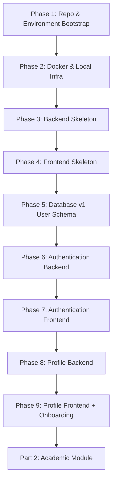

# CareerOS — Implementation Build Plan
## Part 1 of 4 — Foundation, Authentication & User Profile
### Phases 1–9

> **Governing documents:** `agent.md` → `architecture.md` → `api-spec.md` → `db-design.md` → `development.md` → `implementation-roadmap.md`
> **Rule:** Nothing in this plan overrides those documents. This plan only subdivides `implementation-roadmap.md` Phase 0–2 into execution-ready sub-phases for build agents (Claude, Antigravity, Cursor, Copilot).
> **Execution model:** Vertical slice. Each phase must compile, run, and pass its exit criteria before the next phase starts. No phase may be skipped or reordered.

---

## How to read this document

Each phase has the same fixed structure so any AI build agent (Antigravity included) can parse it mechanically:

| Field | Meaning |
|---|---|
| Objective | The single outcome this phase must produce |
| Depends On | Phases that must already be complete |
| Backend Tasks | Spring Boot work, mapped to `controller / service / repository / entity / dto / mapper` |
| Frontend Tasks | React work, mapped to `pages / components / hooks / services` |
| APIs Touched | Endpoints from `api-spec.md` implemented or consumed in this phase |
| DB Changes | Flyway migration(s) introduced in this phase |
| Forbidden In This Phase | Explicit guardrails from `agent.md` that apply here |
| Deliverables | Concrete artifacts that must exist on disk/in the repo |
| Exit Criteria | Machine-checkable conditions before moving on |
| Regression Check | What must still work from prior phases |

---

## Master Flow — Part 1



---

# PHASE 1 — Repository & Environment Bootstrap

### Objective
Stand up the monorepo skeleton, tooling, and environment contracts before any framework code is written.

### Depends On
Nothing. This is the root phase.

### Backend Tasks
- N/A (no Spring Boot code yet)

### Frontend Tasks
- N/A (no React code yet)

### Repo-Level Tasks
- Create monorepo layout:
  ```
  CareerOS/
    frontend/
    backend/
    docs/
    docker/
    scripts/
    .github/
  ```
- Initialize Git, add `.gitignore` for Java, Node, IDE, OS artifacts.
- Add `docs/` copies of `agent.md`, `architecture.md`, `api-spec.md`, `db-design.md`, `development.md`, `implementation-roadmap.md` so every future AI agent session can re-read them.
- Create `.env.example` files (never `.env` with real secrets) for both `frontend/` and `backend/`.
- Define branch strategy per `development.md §30`: `main`, `develop`, `feature/*`, `bugfix/*`, `hotfix/*`.

### APIs Touched
None.

### DB Changes
None.

### Forbidden In This Phase
- ❌ Writing any controller/service/entity code
- ❌ Choosing UI component libraries beyond what `architecture.md` already locks (React, TS, Tailwind)

### Deliverables
- Empty but structured monorepo, committed to `main`
- `README.md` with setup instructions
- `.gitignore`, `.env.example` × 2
- Branching model documented in `docs/development.md` reference

### Exit Criteria
- [ ] Repo clones and shows the exact folder structure above
- [ ] No secrets committed
- [ ] CI placeholder file exists (even if empty) in `.github/workflows/`

### Regression Check
N/A (first phase).

---

# PHASE 2 — Docker & Local Infrastructure

### Objective
Make the full stack (frontend, backend, MySQL, n8n) runnable locally with one command.

### Depends On
Phase 1.

### Backend Tasks
- N/A yet — infra only.

### Frontend Tasks
- N/A yet — infra only.

### Infra Tasks
- `docker/docker-compose.yml` defining services: `mysql`, `backend` (placeholder), `frontend` (placeholder), `n8n`.
- MySQL 8.x service with persisted volume, database name matching `application.yml` convention.
- n8n service scaffolded (no workflows yet — workflows come in Phase 29, Part 4).
- Health-check entries for each container.

### APIs Touched
None.

### DB Changes
- Empty MySQL instance created and reachable. No schema yet (schema begins Phase 5).

### Forbidden In This Phase
- ❌ Writing business logic into n8n
- ❌ Hardcoding DB credentials in `docker-compose.yml` — must come from `.env`

### Deliverables
- `docker-compose.yml`
- `docker/mysql/`, `docker/n8n/` config folders
- `scripts/dev-up.sh` / `dev-down.sh` convenience scripts

### Exit Criteria
- [ ] `docker compose up` brings up MySQL and n8n containers healthy
- [ ] MySQL is reachable on the configured port with the configured credentials from `.env`

### Regression Check
- Phase 1 repo structure still intact.

---

# PHASE 3 — Backend Skeleton (Spring Boot)

### Objective
Create the Spring Boot project with the exact locked package structure — no business logic yet.

### Depends On
Phase 2.

### Backend Tasks
- Initialize Spring Boot (Java 21, Maven) per `implementation-roadmap.md` Phase 0.
- Create locked package skeleton (`architecture.md §14`, `development.md §2`):
  ```
  com.careeros
    config/
    controller/
    service/
    repository/
    entity/
    dto/
    mapper/
    security/
    validation/
    exception/
    scheduler/
    util/
  ```
- Add dependencies: Spring Web, Spring Data JPA, Spring Security, Spring Validation, MySQL driver, Flyway, Lombok (if approved), JWT library.
- Add `application.yml` with profiles: `dev`, `test`, `prod` (`architecture.md §23`).
- Add a single `HealthController` returning `{status: "UP"}` — the only controller allowed in this phase, purely to prove the skeleton boots.
- Add Global Exception Handler shell (`development.md §15`) — structure only, no business exceptions yet.

### Frontend Tasks
None.

### APIs Touched
- `GET /api/v1/health` (internal, not part of the public contract in `api-spec.md`)

### DB Changes
None yet — Flyway wired but no migrations.

### Forbidden In This Phase
- ❌ Any controller beyond the health check
- ❌ Any entity, repository, or service class
- ❌ Any AI integration code

### Deliverables
- Bootable Spring Boot app
- Package skeleton exactly matching `architecture.md §14`
- `application-dev.yml`, `application-test.yml`, `application-prod.yml`

### Exit Criteria
- [ ] `mvn spring-boot:run` boots successfully
- [ ] `GET /health` returns `200 OK`
- [ ] Package structure matches the locked list exactly — no extra top-level packages

### Regression Check
- Docker MySQL/n8n from Phase 2 still up.

---

# PHASE 4 — Frontend Skeleton (React)

### Objective
Create the React application shell with routing, styling, and the locked folder structure — no pages with real logic yet.

### Depends On
Phase 3 (so the frontend can point at a live health endpoint).

### Frontend Tasks
- Initialize React + TypeScript + Vite (or CRA per team preference) + TailwindCSS + React Router + Axios (`architecture.md §5`).
- Create locked folder structure (`architecture.md §12`, `development.md §3`):
  ```
  src/
    pages/
    components/
    layouts/
    hooks/
    services/
    contexts/
    types/
    constants/
    utils/
    assets/
  ```
- Add a base `ApiClient` (Axios instance) in `services/` pointed at `/api/v1`.
- Add a `HealthCheck` page that calls `GET /health` and renders status — proves frontend↔backend wiring.
- Add Tailwind design tokens placeholder (`development.md §27` — no ad-hoc colors later).

### Backend Tasks
None (uses Phase 3 health endpoint only).

### APIs Touched
- `GET /api/v1/health`

### DB Changes
None.

### Forbidden In This Phase
- ❌ Any business logic, forms, or auth screens
- ❌ Direct Axios calls inside components (must go through `services/`)

### Deliverables
- Running React app
- Folder structure matching the locked list
- One working health-check page proving full-stack connectivity

### Exit Criteria
- [ ] `npm run dev` boots the frontend
- [ ] Health-check page shows backend status live
- [ ] Folder structure matches `architecture.md §12` exactly

### Regression Check
- Backend health endpoint (Phase 3) still returns 200.

---

# PHASE 5 — Database v1: User Schema & Migration Tooling

### Objective
Introduce the first real table (`user`) via Flyway, matching `db-design.md §7` exactly.

### Depends On
Phase 3 (Spring Boot + Flyway wired), Phase 2 (MySQL running).

### Backend Tasks
- Create `V1__Create_User.sql` Flyway migration (`db-design.md §20`).
- Columns exactly as specified: `id (UUID)`, `full_name`, `email (unique)`, `password_hash`, `college`, `university`, `branch`, `semester`, `cgpa`, `study_hours`, `created_at`, `updated_at`.
- Index on `email` (`db-design.md §18`).
- No `User` entity/repository yet — this phase is schema-only, to keep DB and code changes independently reviewable per `development.md §20`.

### Frontend Tasks
None.

### APIs Touched
None.

### DB Changes
- `V1__Create_User.sql` — creates `user` table.

### Forbidden In This Phase
- ❌ Editing this migration file after it is merged — future changes must be `V2`, `V3`, etc. (`agent.md` Database Migrations, `db-design.md §20`)
- ❌ Adding columns not present in `db-design.md §7`

### Deliverables
- `V1__Create_User.sql` applied cleanly on a fresh database

### Exit Criteria
- [ ] Flyway reports `V1` as successfully applied
- [ ] `DESCRIBE user;` matches the column list in `db-design.md §7` exactly
- [ ] `email` has a unique index

### Regression Check
- Backend still boots; health endpoint still 200.

---

# PHASE 6 — Authentication Backend

### Objective
Implement register / login / me / logout with JWT, following the clean layering in `architecture.md §21`.

### Depends On
Phase 5 (user table exists).

### Backend Tasks
- `entity/User.java` mapped to the `user` table from Phase 5.
- `dto/RegisterRequest`, `dto/LoginRequest`, `dto/AuthResponse`, `dto/UserDTO` — entities never leave the backend (`agent.md` DTO Rules).
- `mapper/UserMapper` — Entity ↔ DTO only, never inside controllers (`development.md §13`).
- `repository/UserRepository` — CRUD + `findByEmail` only, no business logic (`agent.md` Repository Rules).
- `service/AuthService` — registration validation, BCrypt hashing, JWT issuance, login verification. All business logic lives here (`architecture.md §16`).
- `security/JwtUtil`, `security/SecurityConfig` — stateless JWT filter chain (`architecture.md §21`: no sessions).
- `controller/AuthController` — thin: receive → validate DTO → call service → return DTO (`agent.md` Controller Rules). Must **not** touch the repository directly.
- `validation/` — request DTO validation annotations for email format, password strength, required fields (`development.md §14`).
- Global Exception Handler: map auth failures to standard error envelope (`architecture.md §20`, `api-spec.md §6`).
- Logging: login attempts (success/failure) with timestamp, user, module, status, request ID — never log passwords or tokens (`development.md §16`).

### Frontend Tasks
None yet (Phase 7).

### APIs Touched (from `api-spec.md §8`)
- `POST /api/v1/auth/register`
- `POST /api/v1/auth/login`
- `GET /api/v1/auth/me`
- `POST /api/v1/auth/logout`

### DB Changes
None new — uses the `user` table from Phase 5.

### Forbidden In This Phase
- ❌ Controller calling `UserRepository` directly
- ❌ Storing plaintext passwords
- ❌ Session-based auth (must be stateless JWT per `architecture.md §21`)

### Deliverables
- Fully working auth module (entity → mapper → service → controller)
- Postman/HTTP collection covering all four endpoints and their documented error responses (`api-spec.md §8`)

### Exit Criteria
- [ ] Register creates a user with a hashed password
- [ ] Duplicate email registration returns the documented conflict error
- [ ] Login returns a valid JWT matching `api-spec.md` response schema
- [ ] `GET /auth/me` with a valid token returns the current user DTO (no entity fields leaked)
- [ ] Expired/invalid token returns `401` in the standard error envelope
- [ ] Unit tests cover `AuthService` (register, login, duplicate email, bad password)

### Regression Check
- Health endpoint still works.
- User table schema untouched (no migration edits).

---

# PHASE 7 — Authentication Frontend

### Objective
Build the UI layer for registration, login, logout, and route protection — zero business logic in React (`architecture.md §10`).

### Depends On
Phase 6.

### Frontend Tasks
- `services/AuthService.ts` — wraps the four auth endpoints; the only place Axios is called for auth (`development.md §26`).
- `hooks/useAuth.ts` — exposes login/register/logout/current-user state; wraps token storage (`development.md §24`).
- `contexts/AuthContext.tsx` — global state for the authenticated user only (`architecture.md §25` / `development.md §25`: global state limited to User, Auth, Theme).
- `pages/LandingPage.tsx`, `pages/LoginPage.tsx`, `pages/RegisterPage.tsx`.
- `components/ProtectedRoute.tsx` — redirects unauthenticated users; wraps all pages beyond Phase 9 onward.
- JWT storage strategy: in-memory + secure storage per team security decision; never treated as source of truth (backend `/auth/me` remains the check).

### Backend Tasks
None (consumes Phase 6 APIs only).

### APIs Touched
- `POST /auth/register`, `POST /auth/login`, `GET /auth/me`, `POST /auth/logout`

### DB Changes
None.

### Forbidden In This Phase
- ❌ Any password/token logic inside page components directly (must go through `hooks/` and `services/`)
- ❌ Client-side-only "authorization" decisions that aren't re-validated by the backend

### Deliverables
- Working Landing → Register → Login → Protected Dashboard placeholder flow

### Exit Criteria
- [ ] User can register, then log in, then see a protected placeholder page
- [ ] Logout clears state and blocks access to protected routes
- [ ] Invalid credentials show the backend's documented error message, not a generic one
- [ ] Refreshing the page preserves the session (via `/auth/me` revalidation)

### Regression Check
- Backend auth endpoints (Phase 6) untouched and still passing their tests.

---

# PHASE 8 — User Profile Backend

### Objective
Allow authenticated users to store academic/placement preference data on their profile (`implementation-roadmap.md` Phase 2).

### Depends On
Phase 6 (JWT auth working).

### Backend Tasks
- `V2__Add_Profile_Fields.sql` if any additional columns beyond `db-design.md §7` are needed for preferences — otherwise reuse existing `user` columns (`college`, `university`, `branch`, `semester`, `cgpa`, `study_hours`). Preferred companies/stack belong to `PLACEMENT_PROFILE` per `db-design.md §12` and are **not** duplicated here.
- `dto/ProfileResponse`, `dto/ProfileUpdateRequest`, `dto/PreferencesUpdateRequest`.
- `service/ProfileService` — validation of semester range, CGPA range, study hours range (`architecture.md §19`).
- `controller/ProfileController` — thin, delegates to `ProfileService`.
- Validation: semester (1–8), CGPA (0.00–10.00), study hours (positive integer, sane max).

### Frontend Tasks
None yet (Phase 9).

### APIs Touched (from `api-spec.md §9`)
- `GET /api/v1/users/profile`
- `PUT /api/v1/users/profile`
- `PATCH /api/v1/users/preferences`

### DB Changes
- Only if `db-design.md` requires new columns not already on `user` — otherwise none. Any new migration must be `V2` and additive only.

### Forbidden In This Phase
- ❌ Storing placement preferences here (that belongs to the Placement module, Part 3)
- ❌ Skipping range validation on semester/CGPA/study hours

### Deliverables
- Profile read/update/preferences endpoints, fully validated

### Exit Criteria
- [ ] Authenticated user can fetch their profile
- [ ] Update rejects out-of-range semester/CGPA/study hours with meaningful validation errors
- [ ] Unauthenticated requests return `401`

### Regression Check
- Auth flow (Phase 6/7) still works end to end.

---

# PHASE 9 — User Profile Frontend & Onboarding

### Objective
Give first-time users a guided setup and returning users an editable profile screen.

### Depends On
Phase 8, Phase 7 (protected routes).

### Frontend Tasks
- `pages/OnboardingWizard.tsx` — multi-step first-time setup (college, branch, semester, CGPA, study hours).
- `pages/ProfilePage.tsx` — view/edit profile.
- `hooks/useProfile.ts`, `services/ProfileService.ts`.
- Redirect logic: users without a completed profile are routed to onboarding before reaching the dashboard placeholder.
- Form validation mirrors backend rules for immediate feedback, but backend remains the authority (`architecture.md §19`: never trust client validation alone).

### Backend Tasks
None (consumes Phase 8 APIs).

### APIs Touched
- `GET /users/profile`, `PUT /users/profile`, `PATCH /users/preferences`

### DB Changes
None.

### Forbidden In This Phase
- ❌ Calculating any recommendation, priority, or academic logic on the frontend
- ❌ Persisting profile data to browser storage as a source of truth

### Deliverables
- Full onboarding → profile edit flow, gated behind authentication

### Exit Criteria
- [ ] New user is forced through onboarding exactly once
- [ ] Returning user with a completed profile skips onboarding
- [ ] Profile edits persist and reload correctly from the backend

### Regression Check
- [ ] Auth (Phase 6/7) still passes
- [ ] Health check (Phase 3/4) still passes
- [ ] Dashboard has access to a real, validated user profile — this is the exit gate for `implementation-roadmap.md` Phase 2

---

## Part 1 — Definition of Done

A build agent may only proceed to **Part 2 (Academic Module)** when:

- [ ] Phases 1–9 all satisfy their individual exit criteria
- [ ] Full regression pass: register → login → onboarding → profile edit → logout → login again
- [ ] No architectural rule from `agent.md` or `architecture.md` was violated (controllers thin, business logic in services, entities never exposed, migrations append-only)
- [ ] `project.md`, and any of `architecture.md` / `api-spec.md` / `db-design.md` that were touched, are updated per `agent.md` Documentation Rules

**Next:** Part 2 — Academic Module (Phases 10–18).
