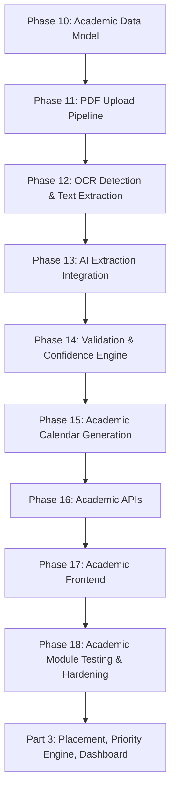
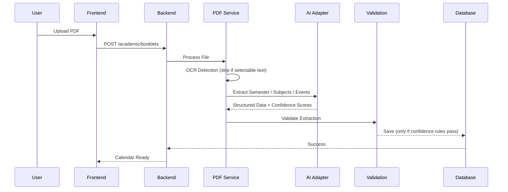

# CareerOS — Implementation Build Plan
## Part 2 of 4 — Academic Module
### Phases 10–18

> **Governing documents:** `agent.md` → `architecture.md` → `api-spec.md` → `db-design.md` → `development.md` → `implementation-roadmap.md`
> **Continues from:** Part 1 (Phases 1–9 — Foundation, Auth, Profile). Do not begin Phase 10 until Part 1's Definition of Done is met.
> **Rule:** This plan only subdivides `implementation-roadmap.md` Phase 3 into execution-ready sub-phases. It does not add, remove, or redesign functionality.

---

## Master Flow — Part 2

## Academic Import Sequence (reference — `architecture.md §44`)

---

# PHASE 10 — Academic Data Model

### Objective
Introduce the Semester, Subject, and AcademicEvent schema exactly as specified in `db-design.md §9–11`, plus the AcademicBooklet table (`db-design.md §8`).

### Depends On
Part 1 complete (user table exists).

### Backend Tasks
- `V3__Create_Semester.sql`, `V4__Create_Subject.sql`, `V5__Create_Academic_Event.sql`, `V6__Create_Academic_Booklet.sql` — one table per migration, never combined (`db-design.md §20`).
- Foreign keys: `semester.user_id → user.id`, `subject.semester_id → semester.id`, `academic_event.semester_id → semester.id`, `academic_booklet.user_id → user.id` (`db-design.md §16`).
- Cascade rule: delete is **restricted**, never cascaded automatically — academic history is never silently destroyed (`db-design.md §17`).
- Indexes: `semester_id`, `user_id`, `event_date` (`db-design.md §18`).
- No entities/repositories yet — schema-only phase, consistent with the Phase 5 pattern in Part 1.

### Frontend Tasks
None.

### APIs Touched
None.

### DB Changes
- `V3`–`V6` as listed above.

### Forbidden In This Phase
- ❌ Storing syllabus topics on `subject` — `db-design.md §10` explicitly excludes this in V1
- ❌ Cascading deletes from `user` down to academic history

### Deliverables
- Four new tables, migrated cleanly on top of Part 1's schema

### Exit Criteria
- [ ] All four tables exist with correct FKs and indexes
- [ ] Deleting a semester without explicit cascade approval is blocked (restrict, not cascade)

### Regression Check
- `user` table and all Part 1 functionality unaffected.

---

# PHASE 11 — PDF Upload Pipeline (Ingestion Only)

### Objective
Accept a booklet PDF, store it, and create a tracked `AcademicBooklet` record with status `PENDING` — no parsing yet.

### Depends On
Phase 10.

### Backend Tasks
- `entity/AcademicBooklet`, `repository/AcademicBookletRepository`.
- `service/BookletUploadService` — file type validation (PDF only), file size validation, versioning logic (`db-design.md §8`: `version`, `active` columns), storage adapter call.
- `controller/AcademicController` (upload endpoint only in this phase) — multipart handling, delegates to service.
- File storage adapter (`architecture.md §46`: isolated behind an adapter so the storage provider can change later).
- Status field lifecycle: `PENDING → PROCESSING → COMPLETED / FAILED` (states used across Phases 12–14).
- Logging: upload event with timestamp, user, file size, status (`development.md §16`).

### Frontend Tasks
None yet (Phase 17).

### APIs Touched (`api-spec.md §16–19`)
- `POST /api/v1/academic/booklets` (Upload Academic Booklet)
- `GET /api/v1/academic/booklets/{id}/status` (Get Booklet Processing Status)
- `GET /api/v1/academic/booklets` (List Academic Booklets)
- `PATCH /api/v1/academic/booklets/{id}/active` (Set Active Booklet)

### DB Changes
None new — uses `V6__Create_Academic_Booklet.sql` from Phase 10.

### Forbidden In This Phase
- ❌ Parsing the PDF content in this phase (belongs to Phase 12)
- ❌ Calling AI directly from the controller (`agent.md` AI Rules / Controller Rules)
- ❌ Skipping file size/type validation (`architecture.md §19`)

### Deliverables
- Working upload + status + list + set-active endpoints, booklet stored with `PENDING` status

### Exit Criteria
- [ ] Non-PDF files are rejected with a validation error
- [ ] Oversized files are rejected per configured limit
- [ ] Multiple uploads correctly increment `version` and only one booklet is `active` at a time

### Regression Check
- Academic tables (Phase 10) untouched structurally; Part 1 auth/profile still pass.

---

# PHASE 12 — OCR Detection & Text Extraction

### Objective
Determine whether a booklet needs OCR and extract raw text, per the pipeline in `architecture.md §33`.

### Depends On
Phase 11.

### Backend Tasks
- `service/OcrDetectionService` — inspects the PDF for selectable text; if present, skip OCR (`architecture.md §33` "OCR Decision").
- `service/TextExtractionService` — extracts raw text either directly (selectable-text PDFs) or via OCR (scanned PDFs).
- Booklet status transitions to `PROCESSING` at the start of this phase's work.
- Temporary OCR output is **never persisted** to the database (`architecture.md §29`, `db-design.md §26`: "Never store temporary OCR data") — it is held in memory/temp storage only, passed forward to Phase 13, then discarded.
- Logging: OCR decision (skipped/ran) and duration, for performance monitoring later (Phase 33).

### Frontend Tasks
None.

### APIs Touched
None new — this phase implements internal pipeline logic invoked asynchronously after Phase 11's upload endpoint.

### DB Changes
None.

### Forbidden In This Phase
- ❌ Persisting raw OCR text to the `academic_booklet` table or anywhere in MySQL
- ❌ Running OCR unconditionally on every file regardless of whether it already has selectable text (wastes processing time — explicitly against `architecture.md §33`)

### Deliverables
- OCR decision engine + text extraction service, unit tested against both a text-based and a scanned sample PDF

### Exit Criteria
- [ ] Text-based PDFs skip OCR entirely (verified via logs/timing)
- [ ] Scanned PDFs are correctly routed through OCR
- [ ] No OCR output rows appear anywhere in the database after processing

### Regression Check
- Upload pipeline (Phase 11) still creates booklets correctly; status still transitions properly.

---

# PHASE 13 — AI Extraction Integration

### Objective
Send extracted text to the LLM to produce structured semester/subject/event data, following the isolated AI adapter pattern.

### Depends On
Phase 12.

### Backend Tasks
- `service/AIService`, `service/PromptBuilder`, `service/PromptTemplates` — implemented now (originally scheduled for the dedicated AI Layer phase) because Academic extraction is the first AI consumer; the same components will be reused and hardened in Part 4, Phase 31.
- Prompt structure follows the fixed shape in `architecture.md §31`: System Prompt → Application Context → User Context → Task → Expected Output Format. Raw database objects are never sent to the LLM.
- AI Adapter isolates the actual provider (OpenAI/Claude) behind an interface (`architecture.md §46`) so providers can be swapped without touching business logic.
- Output: structured JSON containing semester dates, subjects, credits, and academic events, each with a per-field confidence score (`architecture.md §34`).
- Booklet status remains `PROCESSING`.
- AI failures are logged at `ERROR` level (`architecture.md §24`) and the booklet transitions to `FAILED` with a meaningful message — never a silent failure.

### Frontend Tasks
None.

### APIs Touched
None new (internal pipeline step, part of the same async flow started by Phase 11's upload).

### DB Changes
None.

### Forbidden In This Phase
- ❌ AI writing directly to the database (`agent.md` AI Rules: "AI MAY NOT Update Database")
- ❌ AI making any decision beyond extraction (no priority, no business rule evaluation — that is Part 3)
- ❌ Storing the raw AI prompt or raw AI response in the database (`db-design.md §26`)

### Deliverables
- End-to-end text → structured JSON extraction, provider-agnostic via the AI Adapter

### Exit Criteria
- [ ] A sample booklet produces structured semester/subject/event JSON with per-field confidence scores
- [ ] Swapping the mock provider for a real one requires no controller/service changes outside the adapter
- [ ] AI failure path correctly marks the booklet `FAILED` with a resolution-hint message (`agent.md` Error Handling)

### Regression Check
- OCR/text extraction (Phase 12) still feeds this phase correctly.

---

# PHASE 14 — Extraction Validation & Confidence Engine

### Objective
Validate AI output and apply the confidence-based auto-save / manual-review split defined in `architecture.md §32, §34`.

### Depends On
Phase 13.

### Backend Tasks
- `service/ExtractionValidationService` — checks for missing fields, invalid dates, empty values, duplicate events, invalid semester ranges (`architecture.md §32`).
- `service/ConfidenceEvaluator` — applies the rule: confidence ≥ 95% → auto-save; confidence < 95% → manual review required (`architecture.md §34`).
- On validation failure: reject the AI response, and either retry the extraction or flag for user confirmation (`architecture.md §32`).
- On success: persist validated Semester, Subject, and AcademicEvent rows transactionally (`db-design.md §19`: never partially save).
- Update booklet `confidence` and `status` (`COMPLETED` or `PENDING_REVIEW`).

### Frontend Tasks
None yet.

### APIs Touched
- `POST /api/v1/academic/booklets/{id}/refresh` (`api-spec.md §24` — Refresh Academic Extraction), used when a user requests re-processing after a low-confidence result.

### DB Changes
None new — writes into tables created in Phase 10.

### Forbidden In This Phase
- ❌ Auto-saving anything below the 95% confidence threshold
- ❌ Partial saves — semester/subjects/events must commit as a single transaction or not at all

### Deliverables
- Confidence-gated save pipeline, fully transactional

### Exit Criteria
- [ ] High-confidence extractions save automatically and booklet status becomes `COMPLETED`
- [ ] Low-confidence extractions do not write to Semester/Subject/AcademicEvent tables and status becomes `PENDING_REVIEW`
- [ ] Refresh endpoint successfully re-triggers Phases 12–14 for a given booklet

### Regression Check
- AI extraction (Phase 13) output still flows correctly into this validation stage.

---

# PHASE 15 — Academic Calendar Generation

### Objective
Turn validated Semester/AcademicEvent data into a calendar view the dashboard and frontend can consume.

### Depends On
Phase 14.

### Backend Tasks
- `service/CalendarGeneratorService` — assembles semester timeline + academic events (MIDSEM, ENDSEM, HOLIDAY, etc. per `db-design.md §11`) into a calendar-ready structure.
- `dto/CalendarResponse` — never expose entities.
- No business decisions here beyond assembly/formatting — this service does not calculate priority (that is exclusively the Priority Engine in Part 3).

### Frontend Tasks
None yet.

### APIs Touched (`api-spec.md §22`)
- `GET /api/v1/academic/calendar`

### DB Changes
None.

### Forbidden In This Phase
- ❌ Any priority or recommendation logic leaking into calendar generation
- ❌ Returning raw `AcademicEvent` entities instead of DTOs

### Deliverables
- Calendar endpoint returning a structured, chronologically ordered view of the active semester

### Exit Criteria
- [ ] Calendar reflects only the currently `active` booklet's data
- [ ] Events are correctly ordered by date
- [ ] Empty-state (no completed booklet yet) returns a clear, documented response rather than an error

### Regression Check
- Confidence-gated save (Phase 14) still populates the tables this phase reads from.

---

# PHASE 16 — Remaining Academic APIs

### Objective
Complete the Academic module's public contract: Semester, Subjects, Events endpoints beyond upload/calendar.

### Depends On
Phase 15.

### Backend Tasks
- `controller/SemesterController`, `controller/SubjectController`, `controller/AcademicEventController` — each thin, delegating to services already built in Phases 10–15.
- `service/SemesterService`, `service/SubjectService` — read-focused; no new business logic beyond what extraction already produced.
- Pagination applied to subject/event lists per `api-spec.md §13` and `development.md §33` (avoid large unpaginated responses).

### Frontend Tasks
None yet.

### APIs Touched (`api-spec.md §20–23`)
- `GET /api/v1/academic/semester`
- `GET /api/v1/academic/subjects`
- `GET /api/v1/academic/events`
- (Calendar and Refresh already covered in Phases 15 and 14 respectively)

### DB Changes
None.

### Forbidden In This Phase
- ❌ `SELECT *` queries — fetch only required columns (`db-design.md §22`)
- ❌ N+1 queries when loading subjects/events per semester

### Deliverables
- Full Academic API surface matching `api-spec.md §15–24` exactly

### Exit Criteria
- [ ] Every Academic endpoint in `api-spec.md` is implemented and returns the documented response shape
- [ ] Pagination works correctly on list endpoints
- [ ] Query plans show no N+1 pattern for semester→subjects/events loading

### Regression Check
- Calendar (Phase 15) and upload pipeline (Phase 11–14) endpoints all still function.

---

# PHASE 17 — Academic Frontend

### Objective
Build the user-facing Academic Dashboard: upload, processing status, calendar, and subjects screens.

### Depends On
Phase 16, Part 1 Phase 7 (protected routing).

### Frontend Tasks
- `pages/AcademicDashboard.tsx` — entry point, links to upload/calendar/subjects.
- `pages/UploadBookletPage.tsx` — file picker, upload progress, polls booklet status (`GET /booklets/{id}/status`).
- `pages/CalendarPage.tsx` — renders `GET /academic/calendar` output.
- `pages/SubjectsPage.tsx` — renders `GET /academic/subjects`, paginated.
- `components/BookletStatusBadge.tsx`, `components/ConfidenceWarning.tsx` — surfaces `PENDING_REVIEW` state to the user with a clear call-to-action (re-upload or confirm).
- `hooks/useAcademicBooklet.ts`, `hooks/useCalendar.ts`.
- `services/AcademicService.ts` — the single place Axios is called for this module (`development.md §26`).

### Backend Tasks
None (consumes Phase 11–16 APIs).

### APIs Touched
All Academic endpoints from `api-spec.md §15–24`.

### DB Changes
None.

### Forbidden In This Phase
- ❌ Any client-side "extraction" or "validation" of PDF content — that is exclusively a backend/AI pipeline concern
- ❌ Calendar math (e.g., "days until exam") computed on the frontend if it will later feed priority logic — that belongs to the Priority Engine in Part 3; the frontend only renders backend-provided dates

### Deliverables
- Full upload → processing → calendar/subjects UI flow, including the low-confidence manual-review path

### Exit Criteria
- [ ] User can upload a PDF and see live status transitions (`PENDING → PROCESSING → COMPLETED/PENDING_REVIEW/FAILED`)
- [ ] Calendar and Subjects pages render real backend data, paginated where applicable
- [ ] `PENDING_REVIEW` and `FAILED` states are visibly and clearly communicated to the user

### Regression Check
- [ ] Auth/profile flow from Part 1 still works
- [ ] Backend Academic APIs (Phase 16) still pass their tests

---

# PHASE 18 — Academic Module Testing & Hardening

### Objective
Close out the Academic module to production-grade quality before moving to Part 3 (`implementation-roadmap.md` Phase 3 Exit Criteria).

### Depends On
Phases 10–17.

### Backend Tasks
- Unit tests: `BookletUploadService`, `OcrDetectionService`, `ExtractionValidationService`, `ConfidenceEvaluator`, `CalendarGeneratorService` (`development.md §29`, `implementation-roadmap.md` Phase 9 pattern applied early to this module).
- Integration test: full upload → OCR → AI extraction (mocked provider) → validation → save → calendar pipeline.
- Security tests: file upload size/type limits, ownership checks (a user cannot access another user's booklet), auth required on every endpoint.
- Performance check: large subject/event lists paginate correctly; no N+1 queries (cross-check with Phase 16).

### Frontend Tasks
- Manual verification of the full upload UX including failure and low-confidence paths.
- Regression pass across Part 1 flows (register → login → onboarding → profile) to confirm no shared-component breakage.

### APIs Touched
All Academic endpoints — verification pass only, no new endpoints.

### DB Changes
None.

### Forbidden In This Phase
- ❌ Marking this module "done" with any exit criterion unchecked
- ❌ Deferring ownership/authorization checks to a "later security pass"

### Deliverables
- Test suite for the Academic module
- Updated `db-design.md`/`api-spec.md`/`architecture.md` if any implementation detail diverged from the original spec (`agent.md` Documentation Rules — must happen now, not later)

### Exit Criteria
- [ ] Upload → Calendar Generated → Subjects Imported works end to end (`implementation-roadmap.md` Phase 3 Deliverables)
- [ ] A user cannot view or modify another user's academic data
- [ ] All unit and integration tests pass
- [ ] Documentation updated to match final implementation

### Regression Check
- Full Part 1 regression suite (auth, profile, onboarding) still passes.
- **Gate:** Per `implementation-roadmap.md`, the Priority Engine (Part 3) must not start until this module is fully complete.

---

## Part 2 — Definition of Done

A build agent may only proceed to **Part 3 (Placement, Priority Engine, Dashboard)** when:

- [ ] Phases 10–18 all satisfy their individual exit criteria
- [ ] The Academic module is fully functional independent of AI availability for read paths (AI is only in the ingestion pipeline, never in read-time calculation)
- [ ] No AI component writes to the database directly — all writes pass through `ExtractionValidationService`
- [ ] Documentation (`architecture.md`, `api-spec.md`, `db-design.md`) reflects the as-built Academic module

**Next:** Part 3 — Placement Module, Priority Engine, Dashboard Integration (Phases 19–27).
