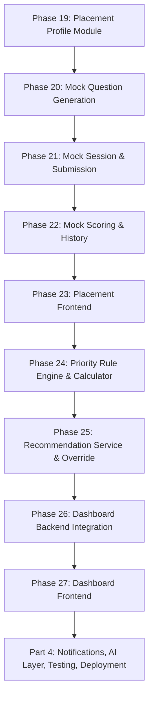
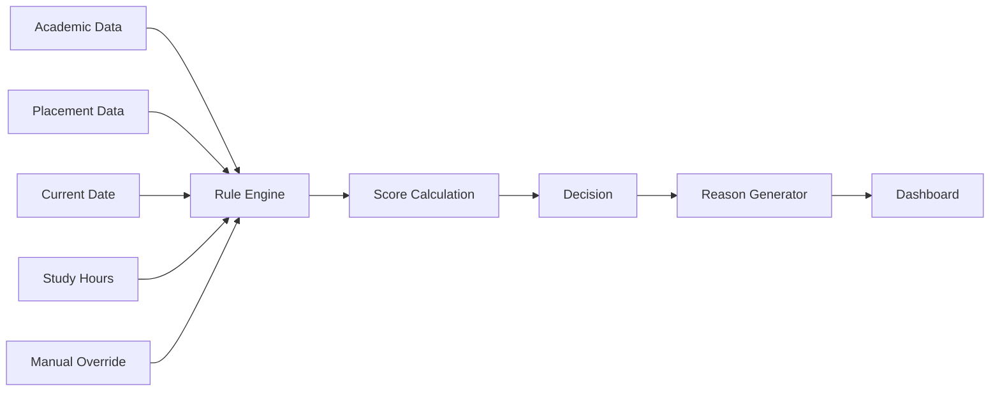

# CareerOS — Implementation Build Plan
## Part 3 of 4 — Placement Module, Priority Engine & Dashboard
### Phases 19–27

> **Governing documents:** `agent.md` → `architecture.md` → `api-spec.md` → `db-design.md` → `development.md` → `implementation-roadmap.md`
> **Continues from:** Part 2 (Phases 10–18 — Academic Module). Do not begin Phase 19 until Part 2's Definition of Done is met.
> **Rule:** This plan subdivides `implementation-roadmap.md` Phases 4–6. The Priority Engine is the product's core IP — no AI involvement in its decisions (`architecture.md §36–37`).

---

## Master Flow — Part 3

## Priority Engine Internal Flow (reference — `architecture.md §36`)

---

# PHASE 19 — Placement Profile Module

### Objective
Let users store placement preferences: role, tech stack, target companies (`db-design.md §12`).

### Depends On
Part 1 (Auth/Profile) and Part 2 complete.

### Backend Tasks
- `V7__Create_Placement_Profile.sql` — `preferred_role`, `preferred_stack (JSON)`, `preferred_companies (JSON)`, FK to `user.id`.
- `entity/PlacementProfile`, `repository/PlacementProfileRepository`.
- `service/PlacementProfileService` — validation of role/stack/company inputs.
- `controller/PlacementProfileController` — thin, standard CRUD-through-service pattern already established in Phase 8.
- `dto/PlacementProfileDTO`, mapper.

### Frontend Tasks
None yet (bundled into Phase 23).

### APIs Touched
- New: `GET /api/v1/placement/profile`, `PUT /api/v1/placement/profile` (extends the placement section of `api-spec.md §25` group; document if not already itemized).

### DB Changes
- `V7__Create_Placement_Profile.sql`.

### Forbidden In This Phase
- ❌ Storing placement preferences on the `user` table (violates `db-design.md §12` separation)
- ❌ Any recommendation logic here — this module only stores preferences, it never decides anything

### Deliverables
- Placement profile CRUD, fully validated and isolated from the Academic module

### Exit Criteria
- [ ] User can save/update role, stack, and target companies
- [ ] Data round-trips correctly as JSON without corruption
- [ ] Ownership enforced (a user only sees their own placement profile)

### Regression Check
- Part 1 and Part 2 modules unaffected.

---

# PHASE 20 — Mock Interview Engine: Question Generation (AI-Assisted)

### Objective
Generate mock interview questions (DSA, Technical, HR, Aptitude) via the AI Adapter, reusing the pattern from Part 2 Phase 13.

### Depends On
Phase 19; AI Adapter pattern established in Part 2 Phase 13.

### Backend Tasks
- `service/QuestionGeneratorService` — calls `AIService`/`PromptBuilder` (already built in Phase 13) with mock-type-specific prompt templates.
- Mock types enumerated per `db-design.md §13`: `DSA`, `TECHNICAL`, `HR`, `APTITUDE`.
- AI output validated (`ResponseValidator`, reused/extended) before being served — malformed or incomplete question sets are rejected and regenerated, never shown broken to the user.
- No database writes of AI-generated questions as permanent content in this phase — questions are generated per session (Phase 21 persists the session, not a static question bank, unless the team explicitly decides to cache templates — if so, document that decision in `db-design.md` "Future Tables").

### Frontend Tasks
None yet.

### APIs Touched (`api-spec.md §40`)
- `POST /api/v1/ai/mock/questions` (Generate Mock Questions)

### DB Changes
None new.

### Forbidden In This Phase
- ❌ AI deciding difficulty progression, scoring weight, or pass/fail — those remain deterministic, backend-owned decisions (`agent.md` AI Rules)
- ❌ Calling the AI provider directly from a controller

### Deliverables
- Working question-generation service across all four mock types

### Exit Criteria
- [ ] Each mock type returns a well-formed, validated question set
- [ ] Malformed AI responses are caught and retried, never surfaced raw to the user

### Regression Check
- Academic AI extraction pipeline (Part 2) still functions — confirms the shared `AIService`/`AI Adapter` wasn't broken by this reuse.

---

# PHASE 21 — Mock Session & Submission

### Objective
Let a user start a mock, answer it, and submit it for evaluation.

### Depends On
Phase 20.

### Backend Tasks
- `V8__Create_Mock_Session.sql` per `db-design.md §13`: `mock_type`, `topic`, `score`, `duration`, `created_at`, FK to `user.id`.
- `entity/MockSession`, `repository/MockSessionRepository`.
- `service/MockEngineService` — orchestrates: start session (calls Phase 20's question generator) → track duration → accept submitted answers.
- `controller/MockController` — `start` and `submit` endpoints, thin.
- `service/AnswerEvaluationService` — for evaluated types (e.g., technical/HR free-text), calls AI (`api-spec.md §41` Evaluate Mock Answers) for **explanation/scoring assistance only**; final score persistence and pass/fail thresholds are backend-owned business rules, not AI decisions.

### Frontend Tasks
None yet.

### APIs Touched (`api-spec.md §26–28`)
- `POST /api/v1/placement/mocks/start`
- `POST /api/v1/placement/mocks/{id}/submit`
- `POST /api/v1/ai/mock/evaluate` (`api-spec.md §41`)

### DB Changes
- `V8__Create_Mock_Session.sql`.

### Forbidden In This Phase
- ❌ AI directly writing the final score to the database (`agent.md` AI Rules: "AI MAY NOT Update Database")
- ❌ Skipping duration tracking (needed for analytics and, indirectly, the study-hours signal used later by the Priority Engine)

### Deliverables
- Start → answer → submit flow persisted as a `MockSession` row with a backend-computed score

### Exit Criteria
- [ ] Starting a mock generates a valid question set and creates a `PENDING` session
- [ ] Submitting answers computes and persists a score via backend logic (AI assists evaluation, backend finalizes)
- [ ] Duration is accurately recorded

### Regression Check
- Question generation (Phase 20) and Placement profile (Phase 19) still function.

---

# PHASE 22 — Mock Scoring & History

### Objective
Expose mock results and historical performance to the user.

### Depends On
Phase 21.

### Backend Tasks
- `service/MockHistoryService` — paginated retrieval of past sessions, filterable by `mock_type`.
- `controller/MockHistoryController` — results and history endpoints.
- `dto/MockResultDTO`, `dto/MockHistoryDTO`.

### Frontend Tasks
None yet.

### APIs Touched (`api-spec.md §28`)
- `GET /api/v1/placement/mocks/history`
- `GET /api/v1/placement/mocks/{id}/result`

### DB Changes
None new — reads from `V8` table (Phase 21).

### Forbidden In This Phase
- ❌ Unpaginated history queries (`development.md §33`)
- ❌ Recalculating scores at read time — score is fixed at submission time (Phase 21) and never silently changed

### Deliverables
- History and result endpoints, paginated, filterable

### Exit Criteria
- [ ] History reflects all of a user's completed mocks accurately
- [ ] Result view matches what was computed and stored at submission time

### Regression Check
- Mock start/submit flow (Phase 21) unaffected.

---

# PHASE 23 — Placement Frontend

### Objective
Build the full Placement UI: mock selection, live interview screen, score screen, history screen, and the placement-profile UI deferred from Phase 19.

### Depends On
Phases 19–22, Part 1 Phase 7 (protected routing).

### Frontend Tasks
- `pages/PlacementProfilePage.tsx` — role/stack/companies form (completes Phase 19's UI).
- `pages/MockSelectionPage.tsx` — choose mock type (DSA/Technical/HR/Aptitude).
- `pages/MockInterviewPage.tsx` — question rendering, answer capture, timer.
- `pages/MockScorePage.tsx` — result display post-submission.
- `pages/MockHistoryPage.tsx` — paginated history list.
- `hooks/useMockSession.ts`, `services/PlacementService.ts`.

### Backend Tasks
None (consumes Phases 19–22 APIs).

### APIs Touched
All Placement + Mock endpoints from `api-spec.md §25–28`.

### DB Changes
None.

### Forbidden In This Phase
- ❌ Client-side scoring or difficulty logic — the frontend only renders backend-provided questions and backend-computed scores
- ❌ Persisting mock answers/results to browser storage as a source of truth

### Deliverables
- Full mock interview UX: select → take → submit → see score → view history

### Exit Criteria
- [ ] User completes a full mock end to end through the UI
- [ ] Score and history screens match backend data exactly
- [ ] Placement profile is editable and persists

### Regression Check
- [ ] Academic module (Part 2) UI unaffected
- [ ] Auth/profile flow (Part 1) unaffected
- [ ] This closes `implementation-roadmap.md` Phase 4 — Dashboard integration must not start until this is verified complete

---

# PHASE 24 — Priority Rule Engine & Calculator

### Objective
Build the deterministic, non-AI decision engine that is CareerOS's core IP (`agent.md` Priority Engine Rules, `architecture.md §36–37`).

### Depends On
Part 2 (Academic data available) and Phase 19–22 (Placement/Mock data available).

### Backend Tasks
- `service/PriorityRuleEngine` — pure, deterministic rules. Examples from `architecture.md §37`:
  - `Exam > 30 days away → Placement priority`
  - `Exam ≤ 14 days away → Academic priority`
  - Intermediate bands defined explicitly by the team and documented in `architecture.md` if new thresholds are introduced.
- `service/PriorityCalculator` — combines rule outcomes with study-hour signals and mock-activity recency into a single priority decision + confidence.
- Inputs strictly limited to: Academic Module data, Placement Module data, current date, study hours, manual override (`architecture.md §36` "Inputs") — **no AI input of any kind** in this phase.
- No frontend, no n8n, no repository, and no controller may perform this calculation — it lives only in `PriorityService`/`PriorityCalculator`/`PriorityRuleEngine` (`agent.md` Priority Engine Rules: "Nobody except Priority Service may calculate priority").
- Unit tests covering every rule boundary (exactly 30 days, exactly 14 days, no exam scheduled, multiple overlapping exams).

### Frontend Tasks
None.

### APIs Touched
None yet (internal service layer; API exposed in Phase 25).

### DB Changes
None new — reads from tables built in Part 2 and Phases 19–22.

### Forbidden In This Phase
- ❌ Any AI call anywhere in this service chain
- ❌ Frontend, n8n, or repository classes containing any part of this calculation (`agent.md`, `architecture.md §15`: Dashboard → Priority Service → Academic Service → Repository is the only allowed dependency direction)

### Deliverables
- Fully deterministic `PriorityRuleEngine` + `PriorityCalculator`, unit tested at every rule boundary

### Exit Criteria
- [ ] Given fixed academic/placement/study-hour inputs, the engine always returns the same output (deterministic, no randomness, no AI variance)
- [ ] All documented rule thresholds are covered by unit tests
- [ ] No AI dependency exists anywhere in the call path

### Regression Check
- Academic (Part 2) and Placement (Phases 19–22) data sources still return correct, unmodified data.

---

# PHASE 25 — Recommendation Service, Explanation & Manual Override

### Objective
Wrap the Priority Engine with persistence, human-readable explanation, and user override capability (`architecture.md §38–39`).

### Depends On
Phase 24.

### Backend Tasks
- `V9__Create_Recommendation_History.sql` per `db-design.md §14`: `priority`, `reason`, `recommended_hours`, `accepted`, `generated_at`, FK to `user.id`.
- `entity/RecommendationHistory`, `repository/RecommendationRepository`.
- `service/RecommendationService` — calls `PriorityCalculator` (Phase 24), persists the result, and requests a human-readable explanation.
- `service/ExplanationGeneratorService` — **may** call AI to phrase the reason in natural language (`architecture.md §39`: "The explanation may be AI-generated, but the recommendation itself is backend-generated"), but the underlying priority/reason data comes entirely from `PriorityRuleEngine`, never from AI judgment.
- Manual override flow (`architecture.md §38`): user override is saved as its own record, never mutates the underlying rule engine or its rules — it only changes *today's* displayed recommendation and is logged for analytics.
- `controller/PriorityController` — thin, exposes calculate/override endpoints.

### Frontend Tasks
None yet (bundled into Phase 27's Dashboard frontend).

### APIs Touched (`api-spec.md §30–32`)
- `GET /api/v1/dashboard/priority`
- `POST /api/v1/dashboard/priority/override`
- `GET /api/v1/dashboard/study-hours`

### DB Changes
- `V9__Create_Recommendation_History.sql`.

### Forbidden In This Phase
- ❌ Override changing the Priority Engine's rules or future calculations — it only affects the current recommendation instance (`architecture.md §38`)
- ❌ AI-generated explanation text containing or implying a different priority than what the Rule Engine decided

### Deliverables
- Persisted recommendation history, natural-language explanations, override capability with analytics logging

### Exit Criteria
- [ ] Every generated recommendation is persisted with priority, reason, recommended hours, and confidence
- [ ] Overriding today's recommendation does not alter tomorrow's automatic calculation
- [ ] Explanation text is coherent and consistent with the underlying rule decision

### Regression Check
- Priority Rule Engine (Phase 24) outputs remain unchanged by the addition of persistence/explanation/override.

---

# PHASE 26 — Dashboard Backend Integration

### Objective
Assemble Academic, Placement, Priority, and Notification-ready data into a single dashboard payload (`implementation-roadmap.md` Phase 6).

### Depends On
Phases 15 (Academic Calendar), 22 (Mock History), 25 (Recommendation).

### Backend Tasks
- `service/DashboardService` — orchestrates calls to `AcademicService`, `MockHistoryService`, `RecommendationService` (allowed dependency direction per `architecture.md §15`: Dashboard → Priority Service → Academic Service → Repository).
- `controller/DashboardController` — single aggregation endpoint.
- `dto/DashboardDTO` — composed of sub-DTOs already defined in earlier phases; no new entity exposure.
- Note: Notification Center widget's data source (`NotificationService`) is not yet built — this phase stubs that section of the DTO as an empty list, to be filled in Part 4 Phase 28.

### Frontend Tasks
None yet (Phase 27).

### APIs Touched (`api-spec.md §29`)
- `GET /api/v1/dashboard`

### DB Changes
None new.

### Forbidden In This Phase
- ❌ Dashboard querying repositories directly, bypassing the established services (`architecture.md §15`)
- ❌ Recomputing priority inline in the dashboard controller instead of calling `RecommendationService`

### Deliverables
- Single dashboard aggregation endpoint returning today's priority, recommended study hours, upcoming academic events, and recent mock history

### Exit Criteria
- [ ] One API call returns everything the dashboard UI needs (excluding notifications, stubbed until Part 4)
- [ ] Response composed entirely of DTOs, no leaked entities
- [ ] Aggregation respects the module dependency direction defined in `architecture.md §15`

### Regression Check
- Academic Calendar (Phase 15), Mock History (Phase 22), and Recommendation (Phase 25) each still work independently of the aggregation layer.

---

# PHASE 27 — Dashboard Frontend

### Objective
Make the dashboard the application's home page (`implementation-roadmap.md` Phase 6 Deliverables).

### Depends On
Phase 26, Part 1 Phase 7.

### Frontend Tasks
- `pages/DashboardPage.tsx` — becomes the default authenticated landing page (replacing the placeholder from Part 1 Phase 7).
- `components/PriorityCard.tsx` — displays today's priority, reason, recommended hours; includes the override control (`POST /priority/override`).
- `components/UpcomingEvents.tsx` — from Academic Calendar data.
- `components/ProgressCard.tsx` — recent mock history summary.
- `components/NotificationPanel.tsx` — scaffolded now with an empty state; wired to real data in Part 4 Phase 30.
- `hooks/useDashboard.ts`, `services/DashboardService.ts`.

### Backend Tasks
None (consumes Phase 26 API).

### APIs Touched
- `GET /dashboard`, `POST /dashboard/priority/override`

### DB Changes
None.

### Forbidden In This Phase
- ❌ Any priority/recommendation calculation performed in React — the card only renders what the backend returns
- ❌ Overriding the recommendation without confirming the change was persisted via the backend response

### Deliverables
- Fully functional dashboard home page, all widgets live except notifications (stubbed)

### Exit Criteria
- [ ] Dashboard loads all modules using backend APIs only (`implementation-roadmap.md` Phase 6 Exit Criteria)
- [ ] Priority card correctly reflects override actions after they are submitted
- [ ] Layout does not break on tablet/mobile per `development.md §28`

### Regression Check
- [ ] Full regression: register → login → onboarding → academic upload → mock interview → dashboard shows correct aggregated state
- [ ] Part 1 and Part 2 flows remain unaffected

---

## Part 3 — Definition of Done

A build agent may only proceed to **Part 4 (Notifications, AI Layer, Testing, Deployment)** when:

- [ ] Phases 19–27 all satisfy their individual exit criteria
- [ ] The Priority Engine is verified deterministic and AI-free end to end
- [ ] Dashboard is the application's functional home page for an authenticated user
- [ ] `architecture.md`, `api-spec.md`, and `db-design.md` are updated to reflect the as-built Placement, Priority, and Dashboard modules

**Next:** Part 4 — Notifications & n8n, AI Layer Consolidation, Testing, Production Deployment, Future Roadmap (Phases 28–36).
