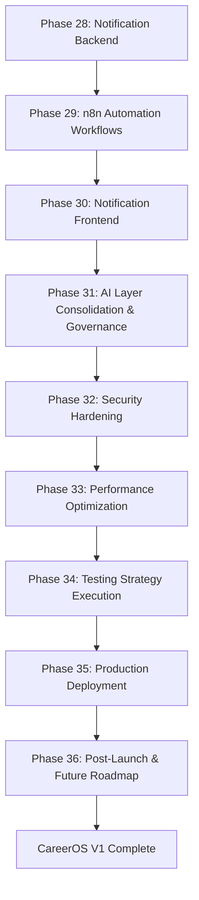
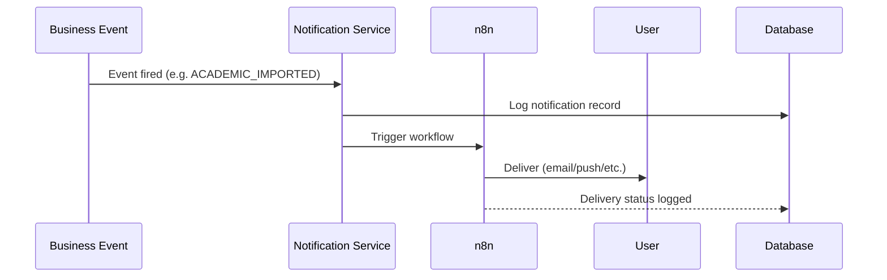
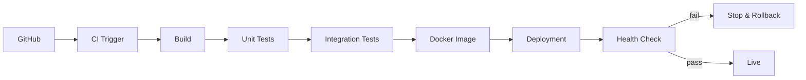

# CareerOS — Implementation Build Plan
## Part 4 of 4 — Notifications, AI Layer, Testing & Production Deployment
### Phases 28–36

> **Governing documents:** `agent.md` → `architecture.md` → `api-spec.md` → `db-design.md` → `development.md` → `implementation-roadmap.md`
> **Continues from:** Part 3 (Phases 19–27 — Placement, Priority Engine, Dashboard). Do not begin Phase 28 until Part 3's Definition of Done is met.
> **Rule:** This plan subdivides `implementation-roadmap.md` Phases 7–10 plus closing hardening work. This is the final part — CareerOS V1 is considered complete at the end of Phase 36.

---

## Master Flow — Part 4

## Notification Flow (reference — `architecture.md §40`)

## Deployment Pipeline (reference — `implementation-roadmap.md` Phase 10)

---

# PHASE 28 — Notification Backend

### Objective
Build the event-driven notification service that Part 3's dashboard stub will consume.

### Depends On
Part 3 complete.

### Backend Tasks
- `V10__Create_Notification.sql` per `db-design.md §15`: `title`, `message`, `type`, `status`, `created_at`, FK to `user.id`.
- `entity/Notification`, `repository/NotificationRepository`.
- `service/NotificationService` — creates notification records in response to internal business events (`architecture.md §42–43`): `ACADEMIC_IMPORTED`, `PRIORITY_UPDATED`, `MOCK_COMPLETED`, `USER_REGISTERED`.
- Internal event listener pattern (`architecture.md §43`): Controller → Service → Business Event → Event Listener → Notification → Logging → Analytics. This keeps modules loosely coupled — the Academic, Placement, and Priority services do not call `NotificationService` directly; they emit events that `NotificationService` subscribes to.
- `controller/NotificationController` — list, mark-read, mark-all-read, delete.
- Explicitly event-driven, never polling-based (`architecture.md §40`).

### Frontend Tasks
None yet (Phase 30).

### APIs Touched (`api-spec.md §33–38`)
- `GET /api/v1/notifications`
- `GET /api/v1/notifications/{id}`
- `PATCH /api/v1/notifications/{id}/read`
- `PATCH /api/v1/notifications/read-all`
- `DELETE /api/v1/notifications/{id}`

### DB Changes
- `V10__Create_Notification.sql`.

### Forbidden In This Phase
- ❌ Polling-based notification checks (`architecture.md §40` mandates event-driven only)
- ❌ Business logic (priority calculation, academic decisions) triggered from inside `NotificationService` — it only reacts to events, never originates business decisions

### Deliverables
- Fully event-driven notification service wired to the four business events

### Exit Criteria
- [ ] Academic import completion, priority change, mock completion, and registration each reliably produce a notification record
- [ ] Mark-read / mark-all-read / delete work correctly and respect ownership
- [ ] No polling mechanism exists anywhere in the notification path

### Regression Check
- Academic, Placement, and Priority modules (Parts 2–3) continue functioning unchanged — event emission must be additive, not intrusive.

---

# PHASE 29 — n8n Automation Workflows

### Objective
Implement the four automation workflows n8n is responsible for, strictly as orchestration (`architecture.md §41`, `agent.md` n8n Rules).

### Depends On
Phase 28 (events and Notification API exist to trigger from).

### n8n Tasks
- **Workflow 1 — Academic Import Completed:** listens for the `ACADEMIC_IMPORTED` event/webhook, sends notification.
- **Workflow 2 — Daily Recommendation Reminder:** scheduled trigger, reads `GET /dashboard/priority` via the backend API, sends a reminder.
- **Workflow 3 — Weekly Summary:** scheduled trigger, collects statistics via backend read APIs, sends a report.
- **Workflow 4 — Calendar Synchronization (stub):** scaffolded for future Google Calendar sync (`architecture.md §41` Workflow 4); no external calendar integration is built in V1, only the workflow shell and a documented extension point.

### Backend Tasks
- Webhook/trigger endpoints (or event-bridge) that n8n calls into, kept minimal and read-only or notification-triggering only.

### Frontend Tasks
None.

### APIs Touched
- Existing read APIs (`/dashboard/priority`, dashboard stats) consumed **by n8n**, not modified.

### DB Changes
None new.

### Forbidden In This Phase
- ❌ n8n calculating priority, writing business data, or making any decision (`agent.md` n8n Rules: "Forbidden: Business Logic, Database Updates, Priority Calculations, AI Decision Making")
- ❌ n8n workflows containing conditional business rules that duplicate what `PriorityRuleEngine` already decided

### Deliverables
- Four n8n workflows, each purely orchestration, calling existing backend APIs

### Exit Criteria
- [ ] Each workflow triggers correctly (event-based or scheduled) and calls only existing, unmodified backend APIs
- [ ] No workflow contains business rule logic
- [ ] Calendar Sync workflow exists as a documented stub, not a broken integration

### Regression Check
- Notification backend (Phase 28) and all business modules (Parts 2–3) remain unaffected — n8n only reads and triggers, never writes business state.

---

# PHASE 30 — Notification Frontend

### Objective
Wire the dashboard's notification panel (stubbed in Part 3 Phase 27) to real data.

### Depends On
Phase 28.

### Frontend Tasks
- `components/NotificationPanel.tsx` — replace the empty-state stub from Part 3 with live data.
- `hooks/useNotifications.ts`, `services/NotificationService.ts`.
- Mark-read / mark-all-read / delete interactions wired to Phase 28's endpoints.
- Badge/counter for unread notifications on the dashboard shell.

### Backend Tasks
None (consumes Phase 28 APIs).

### APIs Touched
All Notification endpoints from `api-spec.md §33–38`.

### DB Changes
None.

### Forbidden In This Phase
- ❌ Client-side polling to simulate "real-time" — if live updates are desired, that is a documented future enhancement (Phase 36), not a workaround built here

### Deliverables
- Fully functional notification panel integrated into the dashboard

### Exit Criteria
- [ ] Notifications generated by Phase 28's events appear correctly in the UI
- [ ] Read/unread state persists correctly across sessions
- [ ] Dashboard (Part 3 Phase 27) is now 100% complete — no stubbed sections remain

### Regression Check
- Full dashboard (Part 3) regression: priority card, upcoming events, mock history, and now notifications all render correctly together.

---

# PHASE 31 — AI Layer Consolidation & Governance

### Objective
Formalize and harden the AI components that were introduced incrementally in Part 2 (Phase 13) and Part 3 (Phases 20–21) into the fully governed AI Layer described in `implementation-roadmap.md` Phase 8 and `architecture.md §30–32`.

### Depends On
Phases 13, 20, 21 (existing AI touchpoints); Parts 2–3 complete.

### Backend Tasks
- Audit and consolidate `AIService`, `PromptBuilder`, `PromptTemplates`, `ResponseValidator`, `ConfidenceEvaluator` into a single well-documented package (`ai/` or equivalent under `service/`), ensuring every existing AI call site (academic extraction, mock question generation, mock evaluation, recommendation explanation) uses the shared components rather than ad hoc duplicates.
- Confirm the AI Adapter boundary (`architecture.md §46`) cleanly isolates the provider (OpenAI/Claude) — provider swap requires touching only the adapter.
- Add a `ResponseValidator` regression suite covering every AI consumer built so far.
- Add rate-limiting/timeout/retry policy around AI provider calls (`development.md §21` AI Integration Rules: never call providers directly from controllers — already enforced, this phase adds resilience).
- Document, in `architecture.md`, the final, authoritative list of what AI is allowed and forbidden to do across the whole system (superset of the per-module rules already applied).

### Frontend Tasks
None.

### APIs Touched
- `POST /api/v1/ai/mock/questions`, `POST /api/v1/ai/mock/evaluate`, `POST /api/v1/ai/recommendation/explain` (`api-spec.md §39–43`) — verified against the consolidated layer, not newly built.

### DB Changes
None.

### Forbidden In This Phase
- ❌ Any new AI capability that touches business rules, database writes, authentication, or priority decisions (`architecture.md §30` Forbidden list, restated here as the final gate)
- ❌ Leaving duplicate/inconsistent prompt-building logic across modules — this phase exists specifically to eliminate that drift

### Deliverables
- Single, governed AI Layer used consistently by every AI-touching feature in the product

### Exit Criteria
- [ ] AI remains completely isolated from business logic (`implementation-roadmap.md` Phase 8 Exit Criteria)
- [ ] Every AI call site in the codebase uses the shared `AIService`/`PromptBuilder`/`ResponseValidator` components
- [ ] Provider swap test: switching the mock/stub provider to another provider requires no changes outside the AI Adapter

### Regression Check
- Academic extraction (Part 2), mock question generation/evaluation (Part 3), and recommendation explanation (Part 3 Phase 25) all still function identically after consolidation.

---

# PHASE 32 — Security Hardening

### Objective
Close out the security checklist across the whole system before test/deployment phases (`development.md §18, §38`, `architecture.md §21–22`).

### Depends On
All previous phases (full feature set must exist to be hardened).

### Backend Tasks
- Full audit: JWT expiration/refresh behavior, BCrypt configuration, HTTPS enforcement in `prod` profile.
- CORS policy review (`api-spec.md §56`) — restrict to known frontend origins.
- Security headers review (`api-spec.md §55`).
- Request size limits (`api-spec.md §57`) and timeout policy (`api-spec.md §58`) applied consistently across all controllers, not just Academic upload.
- Rate limiting (`api-spec.md §47`) applied to auth endpoints and AI-triggering endpoints specifically (highest abuse risk).
- Authorization audit: every endpoint re-checked for ownership enforcement (a user cannot access another user's academic, placement, mock, recommendation, or notification data) — cross-module sweep, not just per-module checks already done in Parts 2–3.
- Secrets audit: confirm nothing is hardcoded anywhere in the repo (`agent.md` Security Rules).
- No stack traces exposed to the frontend anywhere (`agent.md` Security Rules, `architecture.md §20`).

### Frontend Tasks
- Confirm no sensitive data (tokens, internal IDs) is logged to the browser console or stored insecurely.

### APIs Touched
All endpoints — verification pass.

### DB Changes
None.

### Forbidden In This Phase
- ❌ Treating security hardening as optional or deferrable past this phase — `implementation-roadmap.md` Phase 9 explicitly requires Security Tests before Testing sign-off

### Deliverables
- Security audit report covering every item in `development.md §18` and `api-spec.md §55–57`

### Exit Criteria
- [ ] JWT, Authorization, Validation, File Upload, and Rate Limiting all verified per `implementation-roadmap.md` Phase 9 Security Tests
- [ ] Cross-module ownership sweep finds zero unauthorized access paths
- [ ] No secrets, stack traces, or sensitive logs are exposed anywhere

### Regression Check
- Full application regression across Parts 1–4 after security changes are applied (rate limiting, CORS, headers can break existing flows if misconfigured — must be explicitly re-verified).

---

# PHASE 33 — Performance Optimization

### Objective
Verify and tune performance across dashboard, authentication, calendar, mock generation, and recommendation generation (`implementation-roadmap.md` Phase 9 Performance Tests).

### Depends On
Phase 32 (hardened system, ready for load-style verification).

### Backend Tasks
- Query audit: confirm no `SELECT *`, no N+1 queries anywhere (cross-module sweep beyond the Academic-specific check in Part 2 Phase 16).
- Index verification against `db-design.md §18` and the composite index (`user_id + created_at`) noted as a future item — implement now if usage patterns justify it.
- Pagination audit across all list endpoints (Academic subjects/events, Mock history, Notifications).
- Caching decision per `architecture.md §25`: Version 1 uses minimal caching; confirm nothing critical (Authentication, Mock Results) has been inadvertently cached.
- Measure and record baseline performance for: Dashboard load, Authentication, Calendar retrieval, Mock question generation, Recommendation generation (`api-spec.md §64` API Performance Targets).

### Frontend Tasks
- Confirm no unnecessary re-renders or redundant API calls, especially on the Dashboard (Part 3 Phase 27) which aggregates multiple widgets.

### APIs Touched
All endpoints — measurement pass.

### DB Changes
- Optional composite index migration (e.g. `V11__Add_Composite_Index.sql`) if justified by the audit — additive only, never editing prior migrations.

### Forbidden In This Phase
- ❌ Caching Authentication or Mock Results (`architecture.md §25` explicit prohibition)
- ❌ Adding indexes or caching that require schema-breaking changes without a new migration

### Deliverables
- Performance audit report with before/after metrics for the five targeted flows

### Exit Criteria
- [ ] Dashboard, Authentication, Calendar, Mock Generation, and Recommendation Generation are measured against `api-spec.md §64` targets
- [ ] No N+1 queries remain anywhere in the codebase
- [ ] All list endpoints are paginated

### Regression Check
- Full functional regression after any index/query changes.

---

# PHASE 34 — Testing Strategy Execution

### Objective
Execute the complete testing suite defined in `implementation-roadmap.md` Phase 9 across the whole system.

### Depends On
Phases 32–33 (hardened and optimized system).

### Backend Tasks
- **Unit tests:** Authentication, Priority Engine, Academic Module, Placement Module, Notification Module (confirm coverage exists from each part's individual hardening phase — this phase is the consolidated sign-off, not the first time tests are written).
- **Integration tests:** Authentication Flow, Academic Import, Mock Interview, Recommendation Engine, Dashboard.
- **Regression tests:** Authentication, Dashboard, Academic Module, Placement Module, Notifications, API Compatibility — run as a single suite before every release from this point forward (`agent.md` Regression Rules).

### Frontend/QA Tasks
- **End-to-end test:** Landing Page → Login → Profile Setup → Academic Upload → Dashboard → Placement Mock → Notification (`implementation-roadmap.md` Phase 9 E2E flow), executed as one continuous scripted test.
- **Manual verification** of every screen built across Parts 1–4 against its documented exit criteria.

### APIs Touched
All endpoints — full-suite verification.

### DB Changes
None (test execution only; any bug fixes found here follow the same migration/service rules as every other phase — no shortcuts).

### Forbidden In This Phase
- ❌ Marking CareerOS V1 ready without every item in `implementation-roadmap.md` Phase 9 (Unit, Integration, E2E, Regression, Performance, Security) passing
- ❌ Skipping regression on modules that "obviously still work" — every module is re-verified

### Deliverables
- Complete automated testing suite (`implementation-roadmap.md` Phase 9 Deliverables) with a passing run recorded

### Exit Criteria
- [ ] All tests pass (`implementation-roadmap.md` Phase 9 Exit Criteria)
- [ ] E2E flow completes without manual intervention
- [ ] Full regression suite is green

### Regression Check
This phase **is** the regression check for the entire system to date.

---

# PHASE 35 — Production Deployment

### Objective
Deploy CareerOS to production following the pipeline in `implementation-roadmap.md` Phase 10.

### Depends On
Phase 34 (all tests passing).

### Infra/DevOps Tasks
- Production infrastructure: Frontend → Backend → MySQL → n8n → Reverse Proxy → HTTPS (`implementation-roadmap.md` Phase 10 Infrastructure).
- Production checklist: Environment Variables, Database Migration, HTTPS, Logging, Monitoring, Backups, Health Checks.
- CI/CD pipeline: GitHub → CI → Build → Unit Tests → Integration Tests → Docker Image → Deployment → Health Check, stopping on any critical stage failure (`implementation-roadmap.md` Phase 10 Deployment Pipeline).
- Backup strategy live per `db-design.md §23`: daily backup, cloud storage, 30-day retention.
- Production database seeded with **no default data** (`db-design.md §24`).

### Backend Tasks
- Final `prod` profile configuration review (`architecture.md §23`).
- Apply all Flyway migrations (`V1`–`V11+`) to the production database in order, unmodified.

### Frontend Tasks
- Production build verification (no dev-only code paths, no console logging of sensitive data).

### APIs Touched
All — production smoke test after deployment.

### DB Changes
None new — all migrations from Phases 1–33 are applied as-is to production.

### Forbidden In This Phase
- ❌ Deploying with any failing stage in the CI/CD pipeline (`implementation-roadmap.md`: "Deployment stops if any critical stage fails")
- ❌ Manually editing the production database outside of Flyway-managed migrations

### Deliverables
- Live production deployment of CareerOS V1

### Exit Criteria
- [ ] All Production Checklist items verified (`implementation-roadmap.md` Phase 10)
- [ ] CI/CD pipeline runs green end to end
- [ ] Health checks pass in production
- [ ] Success Criteria met: a student can register, log in, complete onboarding, upload a booklet, get an auto-generated calendar, take DSA/Technical/HR/Aptitude mocks, receive a daily recommendation, override it, receive notifications, and use the system without any AI dependency for core business logic (`implementation-roadmap.md` Success Criteria)

### Regression Check
- Production smoke test mirrors the Phase 34 E2E flow against the live environment.

---

# PHASE 36 — Post-Launch Stabilization & Future Roadmap

### Objective
Close the V1 program formally and document what comes next without building it now (`agent.md` Extension Principle: new work becomes new modules, not rewrites).

### Depends On
Phase 35 (live in production).

### Tasks
- Monitor production logs, health checks, and error rates for an initial stabilization window.
- Confirm the Alpha → Beta → RC → Production release strategy (`implementation-roadmap.md` Release Strategy) was followed and all gates were honored retroactively.
- Update `project.md` and all architecture/API/DB docs to their final, as-built V1 state (`agent.md` Documentation Rules — final pass).
- Record open questions and deferred items honestly rather than silently dropping them:
  - Google Calendar sync (n8n Workflow 4 stub from Phase 29)
  - Redis caching (`architecture.md §25` future item)
  - ADMIN/FACULTY/STUDENT roles beyond the single `USER` role (`architecture.md §22`)
  - Future tables: `resume`, `leetcode_progress`, `github_activity`, `calendar_sync`, `study_session` (`db-design.md §25`)
  - Domain services → independent services → microservices migration path (`architecture.md §4`), to be pursued only if scaling need is demonstrated, never speculatively

### Forbidden In This Phase
- ❌ Starting any V2 feature implementation inside this phase — this phase is documentation and stabilization only
- ❌ Silently deprecating anything in the locked architecture without an explicit, approved architecture change

### Deliverables
- Finalized, accurate documentation set
- A written, prioritized (not yet scheduled) V2 backlog derived from the "Future Tables" and "Version 2" notes already present in `db-design.md` and `implementation-roadmap.md`

### Exit Criteria
- [ ] All documentation matches the deployed system exactly
- [ ] V2 backlog is written down, not guessed at during the next build cycle
- [ ] No unresolved regression, security, or performance issue remains open from Phases 32–35

### Regression Check
- Final full-system regression pass, signed off as the closing gate for CareerOS V1.

---

## Part 4 — Definition of Done / Program Completion

CareerOS V1 is complete when:

- [ ] Phases 1–36 across all four parts satisfy their individual exit criteria
- [ ] `implementation-roadmap.md` Success Criteria are met in production
- [ ] `agent.md` Final Constitution principles were upheld throughout: architecture stability over speed, quality over feature count, no sacrifice of long-term maintainability
- [ ] Documentation across `architecture.md`, `api-spec.md`, `db-design.md`, `development.md`, and `implementation-roadmap.md` matches the as-built system

**This closes the 4-part, 36-phase CareerOS implementation build plan.**
