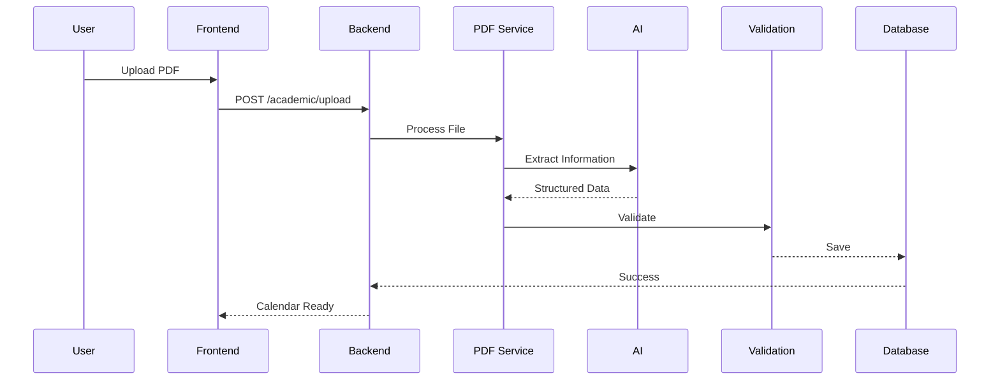
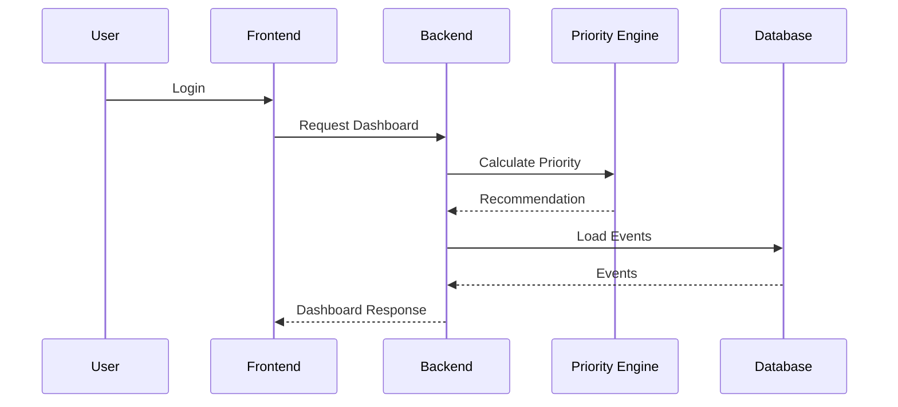

# architecture.md

> **Document Version:** 1.0
>
> **Project:** CareerOS
>
> **Document Type:** System Architecture Document
>
> **Architecture Style:** Modular Monolith (Microservice Ready)
>
> **Status:** Approved for Implementation

---

# 1. Purpose

This document defines the complete technical architecture of CareerOS.

It acts as the single source of truth for all engineering decisions.

Every implementation, feature, API, module, database change, and automation must comply with this architecture.

---

# 2. Architecture Goals

The architecture is designed to achieve the following objectives.

- Maintainability
- Scalability
- Reliability
- Modularity
- Extensibility
- Production Readiness
- Low Coupling
- High Cohesion

The system must support continuous feature additions without requiring existing modules to be rewritten.

---

# 3. Architecture Principles

## Principle 1

Single Responsibility

Each module owns exactly one responsibility.

Example

Academic Module

Responsible only for academic information.

Never placement.

---

## Principle 2

Backend Owns Business Logic

Business rules always remain inside Spring Boot.

Never inside

- React
- n8n
- AI

---

## Principle 3

AI Assists

AI provides

- Extraction
- Explanations
- Mock Questions

AI never makes business decisions.

---

## Principle 4

Database is Source of Truth

The database contains validated structured information.

No frontend cache

No AI output

No automation workflow

is allowed to become the source of truth.

---

## Principle 5

Loose Coupling

Modules communicate only through services.

Never directly.

---

# 4. Architectural Style

CareerOS uses

## Modular Monolith

Reason

- Easier Development
- Faster Deployment
- Lower Infrastructure Cost
- Easier Debugging
- Microservice Migration Ready

Future

```

Modular Monolith

↓

Domain Services

↓

Independent Services

↓

Microservices

```

No architectural redesign should be required.

---

# 5. Technology Stack

## Frontend

- React
- TypeScript
- TailwindCSS
- React Router
- Axios

---

## Backend

- Java 21
- Spring Boot
- Spring Security
- JWT
- Spring Validation
- Spring AI

---

## Database

MySQL

---

## Automation

n8n

---

## AI

OpenAI

Claude

---

## DevOps

Docker

GitHub

GitHub Actions

---

# 6. High Level Architecture

```

                    Browser

↓

React Application

↓

REST API

↓

Spring Boot

↓

Application Services

↓

Repositories

↓

MySQL

↓

Background Jobs

↓

n8n

↓

Notifications

```

---

# 7. System Overview

```

             +-----------------------+
             |     React Frontend    |
             +----------+------------+
                        |
                        |
                Authentication
                        |
                        |
             +----------v-----------+
             |    Spring Boot API   |
             +----------+-----------+
                        |
      ---------------------------------------
      |         |          |         |
      |         |          |         |
 Academic   Placement  Priority  Notification
  Module      Module     Engine      Module
      |         |          |         |
      ----------Shared Service---------
                    |
              AI Integration
                    |
                 MySQL DB
                    |
                   n8n

```

---

# 8. Request Lifecycle

Every request follows one standard flow.

```

React

↓

Controller

↓

Validation

↓

Service

↓

Repository

↓

Database

↓

Response DTO

↓

React

```

Business logic exists only inside Service.

---

# 9. Clean Architecture

```

Presentation Layer

↓

Controller Layer

↓

Service Layer

↓

Repository Layer

↓

Database

```

Never skip layers.

Wrong

```

Controller

↓

Repository

```

Correct

```

Controller

↓

Service

↓

Repository

```

---

# 10. Frontend Architecture

Responsibilities

- Render UI
- Authentication
- Forms
- Calendar
- Dashboard

Frontend must NEVER

- Calculate priorities
- Calculate ROI
- Generate recommendations

Everything comes from backend.

---

# 11. React Architecture

```

App

↓

Layout

↓

Pages

↓

Components

↓

Hooks

↓

Services

↓

API

```

Pages

↓

Reusable Components

↓

Hooks

↓

API

Never

Pages

↓

Business Logic

---

# 12. React Folder Structure

```

src/

components/

pages/

layouts/

hooks/

services/

contexts/

types/

assets/

utils/

constants/

```

Every folder has one responsibility.

---

# 13. Backend Architecture

Backend contains

Authentication

Academic

Placement

Priority

Notification

AI

User

Every module is independent.

---

# 14. Spring Boot Package Structure

```

com.careeros

config

controller

service

repository

entity

dto

mapper

security

exception

validation

scheduler

util

```

Never mix responsibilities.

---

# 15. Module Dependency Rules

Allowed

```

Dashboard

↓

Priority Service

↓

Academic Service

↓

Repository

```

Not Allowed

```

Dashboard

↓

Repository

```

---

# 16. Service Layer

Every feature must expose a service.

Example

AcademicService

Responsibilities

Upload

Extract

Validate

Save

Calendar

No controller should perform these actions.

---

# 17. Repository Layer

Repositories

Only

CRUD

Queries

Nothing else.

No business logic.

---

# 18. DTO Strategy

Never expose Entity objects.

Flow

```

Entity

↓

Mapper

↓

DTO

↓

Frontend

```

Benefits

- Security
- Versioning
- Maintainability

---

# 19. Validation Layer

Every request

↓

Validation

↓

Service

Validation includes

- Required Fields
- Date Validation
- Semester Validation
- File Validation

Never trust client input.

---

# 20. Exception Handling

Global Exception Handler

Handles

Validation Errors

Authentication Errors

Business Errors

Unexpected Errors

Every error returns

```

success

message

timestamp

errorCode

```

No stack traces to frontend.

---

# 21. Authentication Architecture

```

Login

↓

JWT Generated

↓

Frontend Stores Token

↓

Authorization Header

↓

Backend Validation

↓

Access Granted

```

No sessions.

Stateless authentication.

---

# 22. Authorization

Version 1

Single Role

USER

Future

ADMIN

FACULTY

STUDENT

---

# 23. Configuration Management

Configuration never hardcoded.

Use

Environment Variables

application.yml

Profiles

Development

Testing

Production

---

# 24. Logging Architecture

Every important event must generate logs.

Example

Login

↓

INFO

Academic Upload

↓

INFO

AI Failure

↓

ERROR

Priority Generated

↓

INFO

Mock Completed

↓

INFO

Every log includes

Timestamp

Module

Execution Time

Status

User ID

---

# 25. Caching Strategy

Version 1

Minimal Cache

Future

Redis

Cache

- Dashboard
- User Profile
- Academic Calendar

Never cache

Authentication

Mock Results
---

# 26. Database Architecture

## Design Philosophy

The database is the **single source of truth**.

Every piece of information displayed in the application must originate from validated database records.

AI, n8n, frontend state, and caches are temporary consumers—not authoritative sources.

---

## Database Design Principles

- UUID as Primary Key
- Foreign Key Constraints
- Third Normal Form (3NF)
- Soft Delete (where applicable)
- Audit Columns
- Optimistic Locking (Future)
- Indexed Search Fields

---

# 27. Database Overview

```text
                        User
                         │
      ┌──────────────────┼──────────────────┐
      │                  │                  │
AcademicBooklet     PlacementProfile   Recommendation
      │                  │                  │
      │                  │                  │
  Semester          MockSession      Notification
      │
      │
  Subject
      │
      │
AcademicEvent
```

---

# 28. Entity Responsibilities

## User

Stores

- Personal Information
- Study Preferences
- Placement Preferences

Owns

- Semester
- Academic Booklet
- Placement Profile
- Recommendations
- Notifications

---

## Semester

Stores

- Semester Timeline
- Academic Year

Owns

- Subjects
- Academic Events

---

## Subject

Stores

- Subject Name
- Subject Code
- Credits

Version 1 intentionally excludes syllabus topics.

---

## AcademicEvent

Stores

- Mid Semester
- End Semester
- Holidays
- Academic Events

Every event is linked to exactly one semester.

---

## PlacementProfile

Stores

- Preferred Companies
- Preferred Role
- Preferred Tech Stack

---

## MockSession

Stores

Every completed mock interview.

Example

- DSA
- Technical
- HR
- Aptitude

---

## RecommendationHistory

Stores every generated recommendation.

Example

```
Priority

Placement

Reason

No exams within 30 days.

Generated

2026-08-15
```

Useful for analytics.

---

# 29. Database Rules

Never store

- AI Prompt
- AI Raw Response
- Temporary OCR Data

Store only validated structured information.

---

# 30. AI Integration Architecture

## Philosophy

AI is treated as an external intelligent service.

It is never part of the core business logic.

---

## AI Responsibilities

Allowed

- PDF Understanding
- Mock Question Generation
- Explanation Generation

Forbidden

- Business Rules
- Database Updates
- Priority Calculation
- Authentication
- Authorization

---

## AI Communication Flow

```text
Backend

↓

Prompt Builder

↓

LLM

↓

Response

↓

Validation Layer

↓

Application
```

Every AI response passes through validation.

---

# 31. Prompt Architecture

Every prompt follows the same structure.

```text
System Prompt

↓

Application Context

↓

User Context

↓

Task

↓

Expected Output Format
```

Never send database objects directly.

Never expose internal architecture.

---

# 32. AI Response Validation

Validation is mandatory.

Checks include

- Missing Fields
- Invalid Dates
- Empty Values
- Duplicate Events
- Invalid Semester

If validation fails

↓

Reject Response

↓

Retry or Request User Confirmation

---

# 33. PDF Processing Architecture

PDF processing is one of the highest-risk components.

Therefore it uses a multi-stage pipeline.

```text
PDF Upload

↓

Virus Scan (Future)

↓

OCR Detection

↓

Text Extraction

↓

Structured Parser

↓

LLM Extraction

↓

Validation

↓

Confidence Score

↓

Database
```

---

## OCR Decision

If PDF contains selectable text

↓

Skip OCR

If PDF is scanned

↓

Run OCR

This reduces processing time.

---

# 34. Confidence Engine

Every extraction receives a confidence score.

Example

```
Semester Dates

99%

Subjects

98%

Credits

96%

Holiday List

72%
```

Rules

Confidence ≥95%

↓

Auto Save

Confidence <95%

↓

Manual Review Required

---

# 35. Academic Import Sequence

```text
User

↓

Upload PDF

↓

Backend

↓

PDF Service

↓

AI

↓

Validation

↓

Database

↓

Calendar Generated

↓

Dashboard Updated
```

---

# 36. Priority Engine Architecture

## Objective

Determine where today's study effort should be invested.

Nothing else.

---

## Inputs

Current Date

Semester Timeline

Exam Dates

Study Hours

Placement Timeline

Manual Override

---

## Outputs

Priority

Reason

Study Hours

Confidence

---

## Internal Flow

```text
Academic Data

+

Placement Data

↓

Rule Engine

↓

Score Calculation

↓

Decision

↓

Reason Generator

↓

Dashboard
```

---

# 37. Rule Engine

The Rule Engine is deterministic.

Examples

```
Exam >30 Days

↓

Placement
```

```
Exam ≤14 Days

↓

Academics
```

No AI involved.

---

# 38. Manual Override Flow

```text
Recommendation

↓

User Override

↓

Save Override

↓

Update Dashboard

↓

Analytics
```

Override never changes business rules.

It only changes today's recommendation.

---

# 39. Recommendation Explanation Engine

Every recommendation must include a reason.

Example

```text
Priority

Academics

Reason

Mid Semester begins in 8 days.
```

The explanation may be AI-generated,

but the recommendation itself is backend-generated.

---

# 40. Notification Architecture

Notifications are event-driven.

Never polling-based.

---

## Event Sources

Academic Import

Priority Changed

Exam Countdown

Interview Countdown

Weekly Summary

---

## Notification Flow

```text
Business Event

↓

Notification Service

↓

n8n

↓

Delivery

↓

Database Log
```

---

# 41. n8n Architecture

Purpose

Automation only.

Never business logic.

---

## Workflow 1

Academic Import Completed

↓

Send Notification

---

## Workflow 2

Daily Recommendation

↓

Read Backend API

↓

Send Reminder

---

## Workflow 3

Weekly Summary

↓

Collect Statistics

↓

Send Report

---

## Workflow 4

Calendar Synchronization

↓

Future Google Calendar

---

# 42. Event-Driven Architecture

Every important action generates an event.

Examples

```text
PDF_UPLOADED

ACADEMIC_IMPORTED

PRIORITY_UPDATED

MOCK_COMPLETED

USER_REGISTERED
```

Future modules should subscribe to events,

not directly call services.

---

# 43. Internal Event Flow

```text
Controller

↓

Service

↓

Business Event

↓

Event Listener

↓

Notification

↓

Logging

↓

Analytics
```

Loose coupling is maintained.

---

# 44. Sequence Diagram

Academic Import



---

# 45. Dashboard Sequence



---

# 46. Integration Architecture

External integrations are isolated behind adapter services.

```text
CareerOS

│

├── AI Adapter

├── Calendar Adapter

├── Notification Adapter

└── Storage Adapter
```

This allows providers to be replaced without changing business logic.

---

# End of Part 2

**Next Part (Part 3):**

- Security Architecture
- Deployment Architecture
- Docker Architecture
- CI/CD Pipeline
- Monitoring & Logging
- Performance Strategy
- Scalability Roadmap
- Disaster Recovery
- Architecture Decision Records (ADRs)
- Future Microservice Migration
