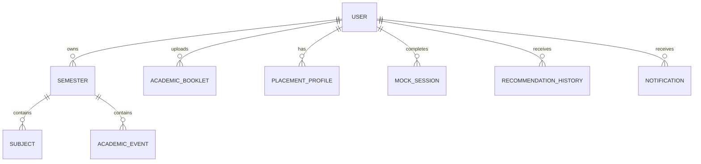

# db-design.md

> **Project:** CareerOS
>
> **Version:** 1.0
>
> **Document Type:** Database Design Document
>
> **Database:** MySQL 8.x
>
> **ORM:** Spring Data JPA (Hibernate)
>
> **Migration Tool:** Flyway
>
> **Status:** Draft

---

# 1. Purpose

This document defines the database architecture of CareerOS.

It serves as the authoritative reference for:

- Database Schema
- Relationships
- Constraints
- Indexes
- Migration Strategy
- Repository Design
- Performance Strategy

---

# 2. Database Goals

The database should provide

- Data Integrity
- High Performance
- Scalability
- Easy Migration
- Strong Relationships
- Zero Data Duplication

---

# 3. Database Engine

```
MySQL 8.x
```

Reasons

- Mature
- ACID Compliant
- Excellent Spring Boot Support
- Strong Indexing
- Reliable Transactions

---

# 4. Naming Convention

Tables

```
snake_case
```

Example

```
academic_booklet

placement_profile

mock_session
```

Columns

```
snake_case
```

Example

```
created_at

updated_at

study_hours
```

Java

```
camelCase
```

---

# 5. Common Columns

Every table contains

| Column | Type |
|----------|------|
| id | UUID |
| created_at | DATETIME |
| updated_at | DATETIME |

Optional

```
deleted_at

created_by

updated_by

version
```

---

# 6. Entity Relationship Diagram



---

# 7. USER Table

```sql
user
```

Purpose

Stores account information.

Columns

| Column | Type |
|----------|------|
| id | UUID |
| full_name | VARCHAR(120) |
| email | VARCHAR(255) UNIQUE |
| password_hash | VARCHAR(255) |
| college | VARCHAR(120) |
| university | VARCHAR(120) |
| branch | VARCHAR(120) |
| semester | INT |
| cgpa | DECIMAL(3,2) |
| study_hours | INT |
| created_at | DATETIME |
| updated_at | DATETIME |

Indexes

```
email
```

---

# 8. ACADEMIC_BOOKLET

Purpose

Stores uploaded PDFs.

Columns

| Column | Type |
|----------|------|
| id | UUID |
| user_id | UUID |
| filename | VARCHAR(255) |
| version | INT |
| confidence | DECIMAL |
| status | ENUM |
| active | BOOLEAN |
| uploaded_at | DATETIME |

---

# 9. SEMESTER

Stores semester information.

Columns

| Column | Type |
|----------|------|
| id | UUID |
| user_id | UUID |
| semester_name | VARCHAR |
| academic_year | VARCHAR |
| start_date | DATE |
| end_date | DATE |

---

# 10. SUBJECT

Columns

| Column | Type |
|----------|------|
| id | UUID |
| semester_id | UUID |
| subject_name | VARCHAR |
| subject_code | VARCHAR |
| credits | INT |

---

# 11. ACADEMIC_EVENT

Stores calendar events.

Columns

| Column | Type |
|----------|------|
| id | UUID |
| semester_id | UUID |
| title | VARCHAR |
| event_type | ENUM |
| event_date | DATE |

Examples

- MIDSEM

- ENDSEM

- HOLIDAY

---

# 12. PLACEMENT_PROFILE

Stores placement preferences.

Columns

| Column | Type |
|----------|------|
| id | UUID |
| user_id | UUID |
| preferred_role | VARCHAR |
| preferred_stack | JSON |
| preferred_companies | JSON |

---

# 13. MOCK_SESSION

Stores every mock.

Columns

| Column | Type |
|----------|------|
| id | UUID |
| user_id | UUID |
| mock_type | ENUM |
| topic | VARCHAR |
| score | INT |
| duration | INT |
| created_at | DATETIME |

---

# 14. RECOMMENDATION_HISTORY

Stores every recommendation.

Columns

| Column | Type |
|----------|------|
| id | UUID |
| user_id | UUID |
| priority | ENUM |
| reason | TEXT |
| recommended_hours | INT |
| accepted | BOOLEAN |
| generated_at | DATETIME |

---

# 15. NOTIFICATION

Stores notifications.

Columns

| Column | Type |
|----------|------|
| id | UUID |
| user_id | UUID |
| title | VARCHAR |
| message | TEXT |
| type | ENUM |
| status | ENUM |
| created_at | DATETIME |

---

# 16. Foreign Keys

```text
semester.user_id

↓

user.id
```

```text
subject.semester_id

↓

semester.id
```

```text
academic_event.semester_id

↓

semester.id
```

Every relationship must enforce referential integrity.

---

# 17. Cascade Rules

Allowed

```
User

↓

Semester
```

Delete

↓

Restrict

Never automatically delete academic history.

---

# 18. Index Strategy

Indexes

```
email

semester_id

user_id

created_at

event_date
```

Future

Composite Index

```
user_id + created_at
```

---

# 19. Transaction Strategy

Use transactions for

Registration

Academic Import

Recommendation Save

Mock Submission

Never partially save data.

---

# 20. Migration Strategy

Tool

```
Flyway
```

Migration Example

```
V1__Create_User.sql

V2__Create_Semester.sql

V3__Create_Subject.sql
```

Never edit old migrations.

Always create new ones.

---

# 21. Repository Design

One repository per aggregate.

Example

```
UserRepository

SemesterRepository

SubjectRepository

AcademicEventRepository

MockSessionRepository
```

Repositories only perform

CRUD

Queries

No business logic.

---

# 22. Query Optimization

Avoid

```
SELECT *
```

Always fetch required columns.

Use pagination.

Avoid N+1 queries.

---

# 23. Backup Strategy

Daily Backup

↓

Cloud Storage

↓

Retention

30 Days

---

# 24. Seed Data

Development

- Sample User
- Demo Semester
- Demo Calendar
- Demo Mock History

Production

No default data.

---

# 25. Future Tables

Version 2

```
resume

leetcode_progress

github_activity

calendar_sync

study_session
```

---

# 26. Database Rules

Never

- Drop production tables
- Rename columns directly
- Store AI raw responses
- Store temporary OCR data

Always

- Validate before save
- Use migrations
- Maintain foreign keys
- Keep schema normalized

---

# END OF DOCUMENT

Document Name

```
db-design.md
```

Status

```
APPROVED
```
